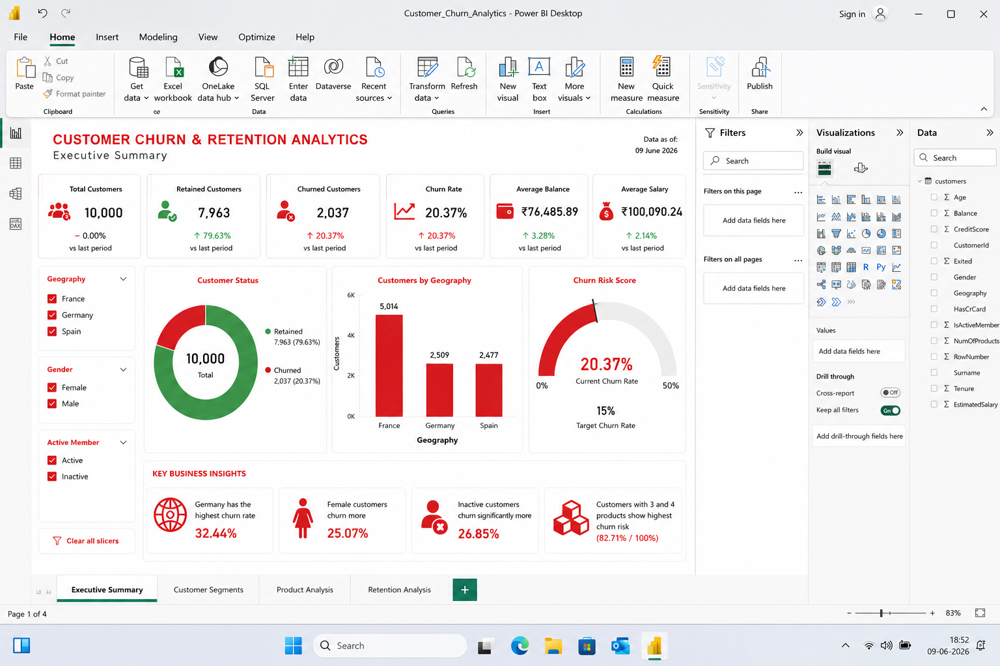

# Customer Churn & Retention Analytics

## Project Overview

Analyzed customer churn behavior using Python, SQL and Power BI.

The project identifies key churn drivers including geography, customer activity status, age groups and product usage patterns.

## Tools Used

- Python
- Pandas
- SQL (SQLite)
- Power BI
- Matplotlib

## Key Insights

- Overall churn rate: 20.37%
- Germany showed highest churn rate (32.44%)
- Female customers churned more frequently than male customers
- Inactive customers churned almost twice as much as active customers
- Customers with 3+ products showed significantly higher churn risk

## Dashboard

## Files

- Customer_Churn_Analytics.ipynb
- customer_churn.db
- customer_churn_dashboard.png
